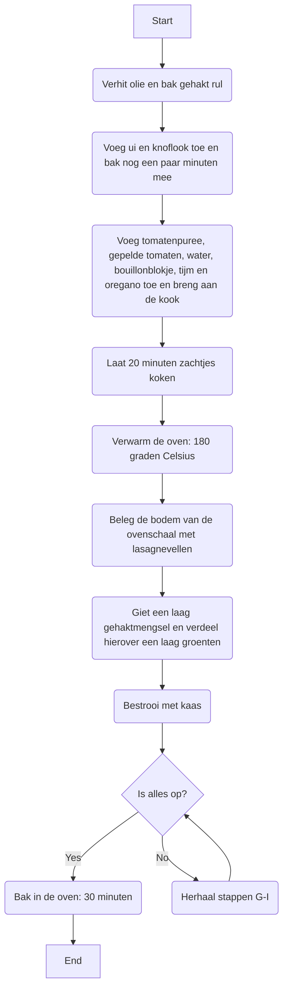

```mermaid
flowchart TD
    A[Start] --> B(Verhit olie en bak gehakt rul)
    B --> C(Voeg ui en knoflook toe en bak nog een paar minuten mee)
    C --> D(Voeg tomatenpuree, gepelde tomaten, water, bouillonblokje, tijm en oregano toe en breng aan de kook)
    D --> E(Laat 20 minuten zachtjes koken)
    E --> F(Verwarm de oven: 180 graden Celsius)
    F --> G(Beleg de bodem van de ovenschaal met lasagnevellen)
    G --> H(Giet een laag gehaktmengsel en verdeel hierover een laag groenten)
    H --> I(Bestrooi met kaas)
    I --> J{Is alles op?}
    J -->|Yes| K(Bak in de oven: 30 minuten)
    J -->|No| L(Herhaal stappen G-I)
    L --> J
    K --> M[End]

```
